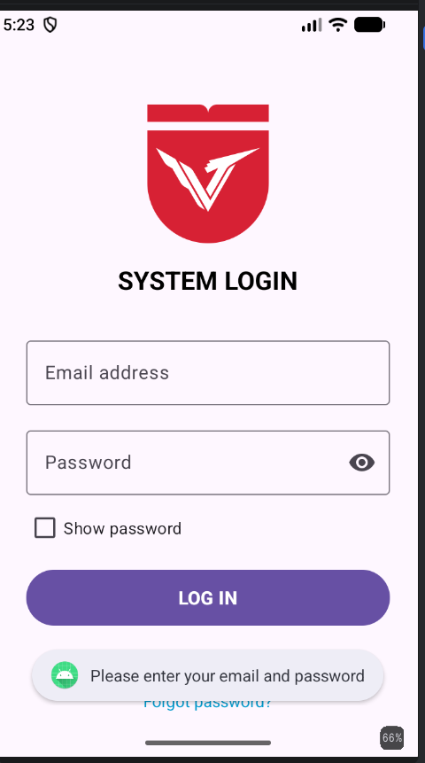
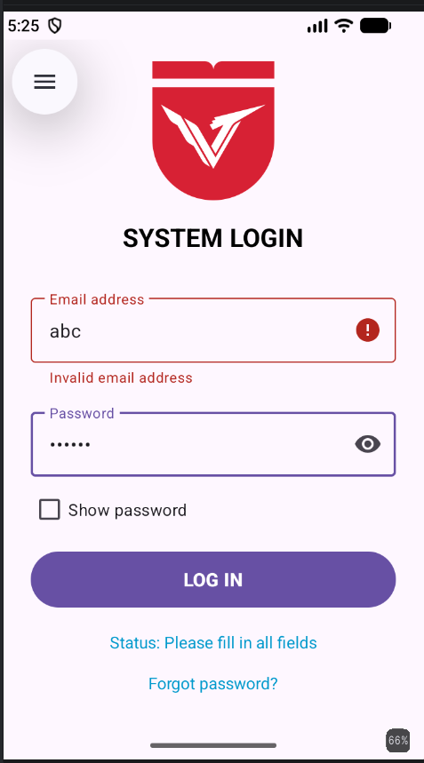
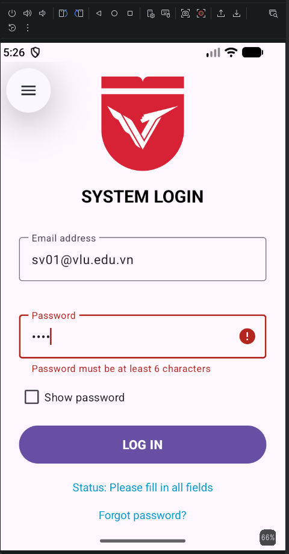
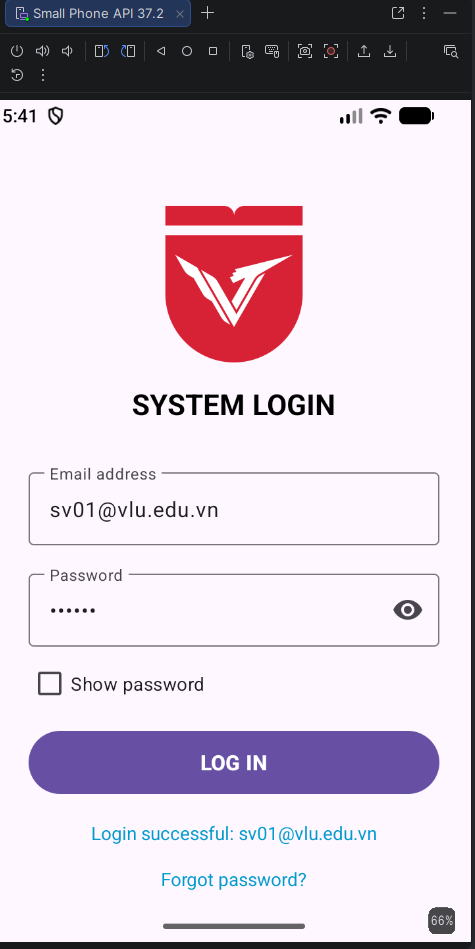
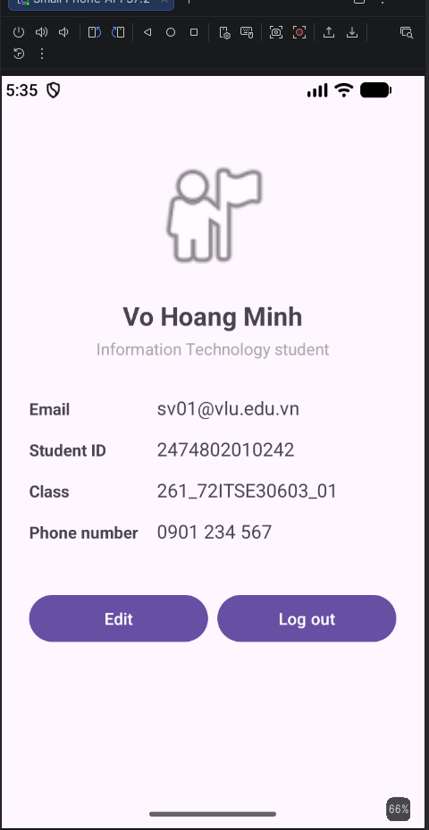
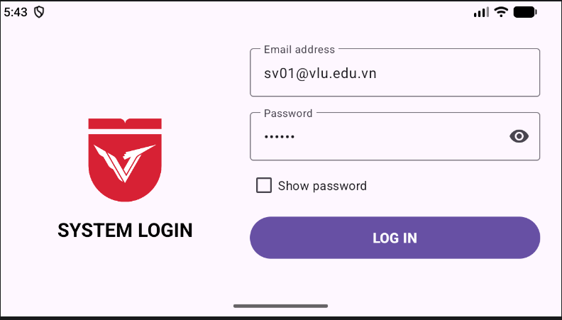
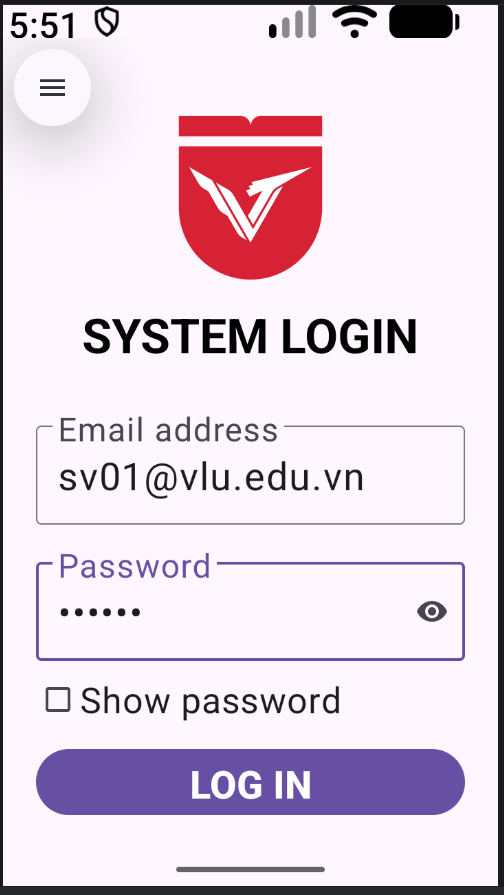
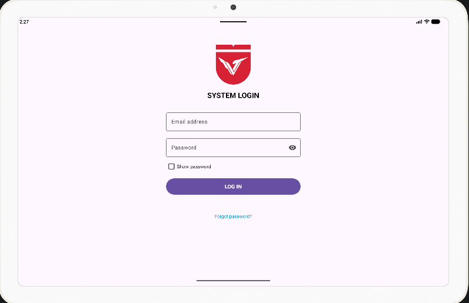
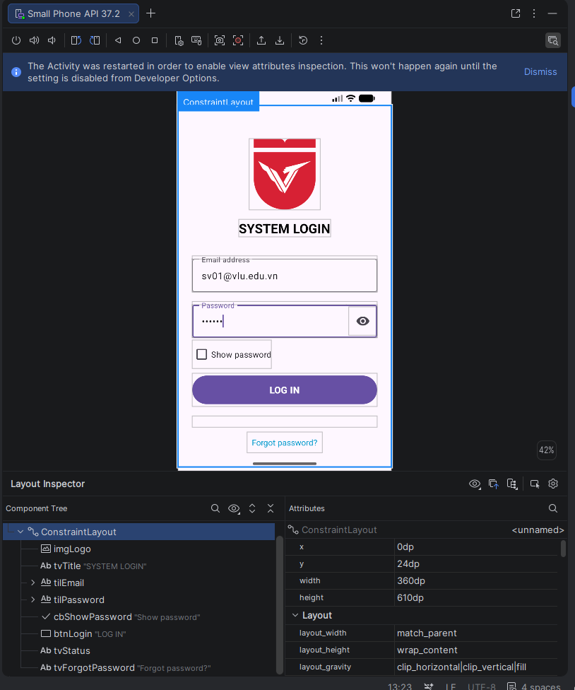

# Lab 02 – Thiết kế giao diện XML & ViewBinding

Ứng dụng Android (Kotlin) gồm hai màn hình **Đăng nhập** và **Hồ sơ người dùng**, dựng bằng
ConstraintLayout phẳng + ViewBinding, responsive cho điện thoại, xoay ngang và tablet.

- **MSSV:** 2474802010242
- **Package:** `vn.edu.vlu.lab2`
- **minSdk 24 / targetSdk 37**, Kotlin DSL, `buildFeatures { viewBinding = true }`

## Đáp ứng yêu cầu

| Mã | Yêu cầu | Thực hiện |
|----|---------|-----------|
| R1 | Màn hình Đăng nhập: logo, tiêu đề, Email, Mật khẩu, nút, trạng thái | `res/layout/activity_login.xml` |
| R2 | Validate: để trống / email sai / mật khẩu < 6 ký tự | `LoginActivity.handleLogin()` dùng `when` |
| R3 | Đăng nhập hợp lệ ⇒ “Đăng nhập thành công: &lt;email&gt;” rồi mở Profile | Xác thực giả lập, truyền email qua `Intent` |
| R4 | Profile: avatar 1:1, tên, vai trò, các dòng nhãn \| giá trị, 2 nút chia đều | `res/layout/activity_profile.xml` (DimensionRatio, Barrier, chain weight) |
| R5 | ConstraintLayout phẳng + ViewBinding, không `findViewById`, chuỗi trong `strings.xml` | Toàn bộ project |
| R6 | Nộp qua GitHub công khai | Repo này |

## Bài tập vận dụng

**Cấp 1**
- Dòng “Quên mật khẩu?” dưới `tvStatus`, nhấn hiện Toast.
- Không còn chuỗi viết cứng; bản tiếng Anh ở `res/values-en/strings.xml`.

**Cấp 2**
- `res/layout-land/activity_login.xml`: logo + tiêu đề ở nửa trái, form ở nửa phải (Guideline dọc 40%).
- CheckBox “Hiện mật khẩu” đổi `transformationMethod` của `edtPassword`.
- Profile có thêm dòng “Số điện thoại”; cột giá trị neo vào `Barrier` sau nhãn dài nhất.

**Cấp 3**
- `TextInputLayout` + `TextInputEditText` (Material), `app:endIconMode="password_toggle"`.
- Màn hình Đăng nhập bọc trong `ScrollView` (`fillViewport="true"`), cộng inset bàn phím nên không bị cắt khi bàn phím hiện.
- `res/layout-sw600dp/activity_login.xml`: trên tablet form rộng tối đa 400dp, căn giữa.

## Kiểm thử

| Tình huống | Dữ liệu | Kết quả |
|-----------|---------|---------|
| Để trống | — | Toast + “Trạng thái: Vui lòng điền đủ dữ liệu” |
| Email sai định dạng | `abc` / `123456` | Lỗi “Email không hợp lệ” dưới ô Email |
| Mật khẩu ngắn | `sv01@vlu.edu.vn` / `123` | Lỗi “Mật khẩu tối thiểu 6 ký tự” |
| Hợp lệ | `sv01@vlu.edu.vn` / `123456` | “Đăng nhập thành công: sv01@vlu.edu.vn”, mở Profile |

### Ảnh chụp màn hình

| Để trống | Email sai | Mật khẩu ngắn | Hợp lệ |
|---|---|---|---|
|  |  |  |  |

| Profile | Xoay ngang | Cỡ chữ lớn nhất | Tablet |
|---|---|---|---|
|  |  |  |  |

### Layout Inspector

## Chạy project

1. Mở thư mục project bằng Android Studio, đợi Gradle Sync.
2. Chạy cấu hình `app` (Shift + F10) trên AVD.

Hoặc dòng lệnh: `./gradlew assembleDebug`
